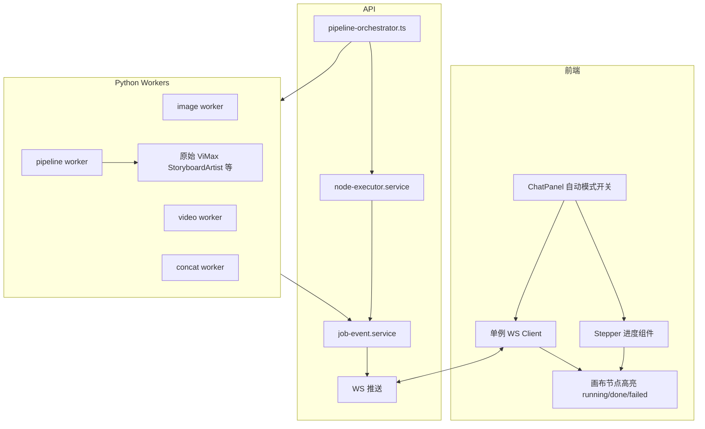

# Spec: 创意输入 → 自动生成分镜/镜头/成片（v1）

| 属性 | 值 |
|------|-----|
| 版本 | 1.0-draft |
| 状态 | ✅ 已确认 |
| 前置依赖 | Phase 0 ✅ / Phase 1 前端重构 / Backend 管线修复（B1-B7，已落地待 commit） |
| 目标 | 打通「输入 → 分镜 → 镜头 → 成片」全链路的可靠性与自动化程度 |

---

## 1. 背景

当前平台已具备节点级生成能力（script / character / storyboard_cell / shot / image / video / concat），但存在两类问题：

1. **可靠性断点**：链路中若干环节存在结果丢失、重复触发、无法中止等缺陷，导致「剧本模式」「灵感模式」E2E 场景不稳定。
2. **自动化缺口**：Chat Agent 只能生成到 script/storyboard_cell/character 层级即停止，storyboard→shot→image→video→concat 需要用户逐个手动点击触发，未达到「输入内容 → 自动出片」的产品目标。

此外，仓库根目录存在一套独立的 Python 决策/对话实现（`agents/decision_agent.py`、`agents/supervision_agent.py`、`pipelines/chat_pipeline.py`），未接入 Web 平台主链路（主链路走 `apps/api/src/domain/agent/decision-layer.ts`），属于重复实现，增加维护与认知成本。

**vimax 关系澄清**：`vimax-platform/` 不是"转发给外部 vimax 后台"，而是通过 `VIMAX_ROOT` 挂载方式，在 Python worker 内部调用仓库根目录的原始 HKUDS/ViMax 多智能体框架（`StoryboardArtist` 等 agent）。本 Spec 不改变这一集成方式，只优化其上层编排与前端可靠性。

---

## 2. 目标

| 目标 | 度量 |
|------|------|
| 手动逐步链路 100% 可靠 | E2E-01/E2E-02 无静默丢失、无重复发送、可中止 |
| 具备「一键自动生成」能力 | 开启自动模式后，输入创意/剧本，无需手动点击即可跑通 script→storyboard→shot→image→video→concat |
| 技术债清理 | 根目录重复 Python 决策实现移除，`AGENTS.md` 补充架构说明 |

### 2.1 非目标（本版本不做）

- 不实现 Python 端 `pipeline.idea2video`/`pipeline.script2video` 整体 CLI 管线接入 Web（路线B，本轮不采用）
- 不做音频生成（`audio.generate` 仍为 stub）
- 不做 `story_push` 完整实现
- 不做完整 i18n

---

## 3. 范围

### 3.1 Phase 1 — 现有链路可靠性修复

| ID | 问题 | 修复方案 | 涉及文件 |
|----|------|----------|----------|
| FR-AG-01 | `generate_assets` 工具生成图片后不写回画布节点，结果丢失 | 工具执行成功入队后追加 `chat.canvas_mutation`（`nodes.add` image 节点，绑定 jobId），前端订阅 job done 后自动挂载资产 | `decision-layer.ts` |
| FR-AG-02 | Home→画布场景下 `GenerationOverlay` 与 `ChatPanel` 可能重复发送同一条 `initialPrompt` | 引入一次性消费标记（如 sessionStorage keyed by canvasId+prompt），确保同一 prompt 只发送一次 | `GenerationOverlay.tsx`, `ChatPanel.tsx`, `page.tsx` |
| FR-AG-03 | image 节点卡片缺少资产预览（video 节点已有） | 补充 `AssetPreview` 到 image 节点卡片 | `CanvasNodes.tsx` |
| FR-AG-04 | `layout.arrange` mutation 为空实现（no-op） | 接入现有 `dagre-layout.ts` 布局函数 | `CanvasProvider.tsx` |
| FR-AG-05 | `chat.canvas_mutation` 契约含 `edges.remove`，但处理器未实现该分支 | 补充 `edges.remove` 处理逻辑 | `CanvasProvider.tsx` |
| FR-AG-06 | `chat.stop` 为 TODO，无法中止进行中的对话/生成 | 基于 `AbortController` 实现取消：WS 收到 stop → abort 当前 LLM 流式请求 + 跳过后续工具调用 | `websocket.ts` |
| FR-AG-07 | `CanvasProvider` 与 `useChatMessages` 各自建立独立 WS 连接，订阅冗余 | 提升为单例 WS client，两者共享同一连接 | `CanvasProvider.tsx`, `useChatMessages.ts` |

### 3.2 Phase 2 — Agent 自动编排（路线A）

新增编排层，**不重新实现生成逻辑**，仅编排已有节点级 API 的调用顺序与并发：

```
runScript2Storyboard
  → (等待 job 完成，产出 storyboard_cell 节点)
  → 对每个 storyboard_cell 并发受限调用 runStoryboard2Shot
  → 对每个 shot 调用 runNode(image) → runNode(video)
  → autoWire 到 concat 节点
  → runNode(concat)
```

| ID | 需求 | 优先级 |
|----|------|--------|
| FR-AG-08 | 新增 `pipeline-orchestrator.ts`，暴露 `runAutoPipeline(canvasId, scriptNodeId, options)` | P0 |
| FR-AG-09 | 新增 tRPC `canvas.runAutoPipeline` → 返回 `runId` | P0 |
| FR-AG-10 | 新增 WS 事件协议（见 §5） | P0 |
| FR-AG-11 | 任一分支失败不阻塞其他分支，结束后汇总失败列表 | P0 |
| FR-AG-12 | 新增 `pipeline.cancel`，支持中止整条自动管线 | P1 |
| FR-AG-13 | ChatPanel 增加「自动模式」开关（默认关闭） | P0 |
| FR-AG-14 | 新增 Stepper UI，展示 6 阶段状态，可点击定位画布节点 | P1 |
| FR-AG-15 | 画布节点复用现有 `running/done/failed` 渲染，无需新状态机 | P0 |

### 3.3 Phase 3 — 技术债清理

| ID | 需求 |
|----|------|
| FR-AG-16 | 确认无脚本引用后，删除 `agents/decision_agent.py`、`agents/supervision_agent.py`、`pipelines/chat_pipeline.py` |
| FR-AG-17 | 补充 `AGENTS.md`：说明对话决策唯一实现为 `decision-layer.ts`，Python 侧仅保留对原始 ViMax agent 的 worker 内桥接调用 |

---

## 4. 架构（目标态）



---

## 5. WS 事件协议（Phase 2 新增）

**Server → Client**

```ts
{ type: "pipeline.stage_start",    runId: string, stage: PipelineStage, nodeIds: string[] }
{ type: "pipeline.stage_progress", runId: string, stage: PipelineStage, done: number, total: number }
{ type: "pipeline.stage_done",     runId: string, stage: PipelineStage }
{ type: "pipeline.node_failed",    runId: string, stage: PipelineStage, nodeId: string, error: string }
{ type: "pipeline.finished",       runId: string, summary: { succeeded: number, failed: number } }
```

**Client → Server**

```ts
{ type: "pipeline.cancel", runId: string }
```

`PipelineStage = "storyboard" | "shot" | "image" | "video" | "concat"`

---

## 6. 用户故事（新增/修订）

### US-07 一键自动生成（新增）
> 作为创作者，我在 ChatPanel 开启「自动模式」并输入创意，系统自动依次生成分镜、镜头、图片、视频并合成，无需我逐步点击。

**验收**：开启自动模式后输入创意，30 分钟内（依赖模型/生成耗时）画布上出现完整 script→storyboard_cell→shot→image→video→concat 图，且可下载最终视频；若某分支失败，其余分支不受影响，Stepper 显示明确失败原因。

### US-08 中止生成（新增）
> 作为创作者，自动生成过程中我可以随时点击「停止」，已完成的节点保留，未开始的任务不再执行。

---

## 7. 验收标准

| # | 验收项 | 验证方式 |
|---|--------|---------|
| 1 | `generate_assets` 生成的图片出现在画布上 | 视觉 + DB |
| 2 | Home→画布不再重复发送同一条 prompt | WS 日志计数 |
| 3 | image 节点卡片显示资产预览 | 视觉 |
| 4 | Agent 调用 `layout.arrange` 后节点重新排列 | 视觉 |
| 5 | Agent 发出 `edges.remove` 后对应连线消失 | 视觉 + DB |
| 6 | 对话中点击「停止」，当前流式响应与后续工具调用终止 | 手测 |
| 7 | 打开画布仅建立一条 WS 连接 | 浏览器 Network 面板 |
| 8 | 开启自动模式输入创意，无人工干预跑到 concat 完成 | E2E |
| 9 | 自动生成过程中点击「取消」，运行中任务停止，已完成节点保留 | 手测 |
| 10 | 根目录重复 Python 决策文件已删除，`pnpm test` / 现有 Python 测试全绿 | CI |

---

## 8. 风险

| 风险 | 影响 | 缓解 |
|------|------|------|
| 自动模式下并发生成大量 image/video job，触达供应商速率限制 | 任务大量失败 | `concurrency` 参数限流，默认低并发 |
| 自动模式跑到一半用户手动编辑画布，状态冲突 | 数据不一致 | 自动模式运行期间锁定编辑或提示冲突 |
| 单例 WS 改造影响现有订阅时序 | 功能回退 | 保留现有 hook 接口，内部改为共享连接，小步提交 + 回归测试 |
| 删除根目录 Python 文件影响未知外部引用 | 破坏性变更 | 删除前全仓库 grep 引用确认 |

---

## 9. 依赖

| 依赖 | 说明 |
|------|------|
| Backend 管线修复（B1-B7） | script2storyboard 落节点、asset kind 已修复（前置） |
| docker-compose workers | image/video/concat/pipeline worker 需运行 |
| 模型 API Key | `.env` 配置 |

---

## 10. Plan 输入（评审后生成）

评审通过后生成 `docs/plans/AUTO-GENERATION-PLAN.md`，按 Phase 1 → Phase 2 → Phase 3 顺序拆解执行步骤，预估工时（评审后确认）。

**当前不执行，等待 Spec 评审确认。**
