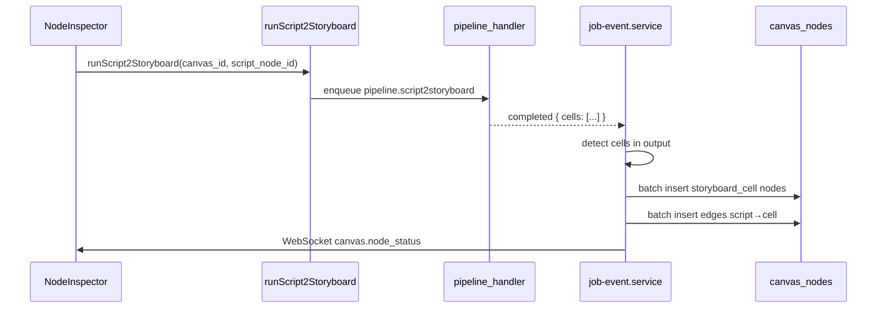

# Spec: Backend — 管线修复（内部 v1）

| 属性 | 值 |
|------|-----|
| 版本 | 1.0-draft |
| 状态 | ✅ 已确认 |
| 前置依赖 | Phase 0 ✅ |
| 目标 | 打通「剧本 → 分镜 → 生成」后端链路，修复 asset 类型 |

---

## 1. 问题陈述

当前后端存在三个阻断内部使用的缺陷：

| # | 问题 | 影响 |
|---|------|------|
| B1 | `pipeline_handler.py` 调用 `publish_started/completed/failed`，但 `JobReporter` 只有 `started/completed/failed` | script2storyboard worker 运行时崩溃 |
| B2 | `job-event.service.ts` 所有 asset 硬编码 `kind: "image"` | 视频资产类型错误 |
| B3 | script2storyboard 完成后返回 `cells`，但 API 不创建 `storyboard_cell` 节点 | 用户需手动建分镜节点 |

---

## 2. 目标

| 目标 | 度量 |
|------|------|
| script2storyboard 端到端可用 | E2E-02 通过 |
| 视频 asset 类型正确 | `kind=video` + `mime_type=video/mp4` |
| Worker 不崩溃 | pipeline worker 日志无 AttributeError |

---

## 3. 范围

### 3.1 包含

| ID | 修复项 |
|----|--------|
| FR-BE-01 | JobReporter 添加 `publish_*` 别名或修正 handler 调用 |
| FR-BE-02 | `pipeline_main.py` JobReporter 构造签名修正 |
| FR-BE-03 | `job-event.service` 根据 mime_type 推断 asset kind |
| FR-BE-04 | script2storyboard 完成时批量创建 storyboard_cell 节点 |
| FR-BE-05 | 自动连线 script → storyboard_cell |
| FR-BE-06 | 单元测试：asset kind 推断、cells → nodes 转换 |

### 3.2 不包含

- `pipeline.idea2video` / `pipeline.script2video` 全流程
- `shot.last_frame` 生成
- `audio.generate` worker
- VideoWorkbench 导入 API
- Python CLI → Platform 完全桥接

---

## 4. 技术设计

### 4.1 JobReporter 修复（FR-BE-01/02）

**方案 A（已确认）**：修正 handler 调用，统一使用 `started/completed/failed`

```python
# pipeline_handler.py — Before
await reporter.publish_started()
await reporter.publish_completed(result)

# After
await reporter.started()
await reporter.completed(result)
```

```python
# pipeline_main.py — 检查构造签名
reporter = JobReporter(redis_client, channel, job_id)
```

**不采用方案 B**（不添加 publish_* 别名）。

### 4.2 Asset Kind 推断（FR-BE-03）

```ts
function inferAssetKind(mimeType: string): "image" | "video" | "audio" {
  if (mimeType.startsWith("video/")) return "video";
  if (mimeType.startsWith("audio/")) return "audio";
  return "image";
}
```

**特殊 case**：`mime_type === "application/json"`（pipeline 结果）→ 不创建 asset，走 cells 处理分支。

### 4.3 Storyboard Cells 落节点（FR-BE-04/05）



#### 4.3.1 Cells → Nodes 映射

```ts
interface StoryboardCell {
  shotBrief: string;
  cameraIdx: number;
  ffDesc?: string;
  lfDesc?: string;
  motionDesc?: string;
}

// 每个 cell → 一个 storyboard_cell 节点
{
  id: uuid(),
  type: "storyboard_cell",
  position: zoneLayout(storyboard_cell, index),
  data: {
    shotBrief: cell.shotBrief,
    cameraIdx: cell.cameraIdx,
    status: "idle",
  }
}
```

#### 4.3.2 连线规则

```
script_node_id → storyboard_cell_id（每个 cell 一条边）
```

#### 4.3.3 触发条件

在 `job-event.service.ts` 的 `completed` 分支：

```ts
if (parsed.output.cells && Array.isArray(parsed.output.cells)) {
  await spawnStoryboardCells(canvasMeta, parsed.output.cells);
  return; // 跳过 asset 创建
}
```

---

## 5. API 契约

### 5.1 pipeline.script2storyboard 输出

```json
{
  "storage_key": "",
  "mime_type": "application/json",
  "cells": [
    {
      "shotBrief": "镜头1: ...",
      "cameraIdx": 0,
      "ffDesc": "首帧描述",
      "lfDesc": "末帧描述",
      "motionDesc": "推近"
    }
  ]
}
```

### 5.2 新增内部函数

```ts
// job-event.service.ts
async function spawnStoryboardCells(
  canvasId: string,
  scriptNodeId: string,
  cells: StoryboardCell[],
): Promise<{ nodeIds: string[] }>
```

```ts
// asset-utils.ts（新文件）
export function inferAssetKind(mimeType: string): AssetKind
```

---

## 6. TDD 计划

| 测试文件 | 覆盖 |
|---------|------|
| `asset-utils.test.ts` | `inferAssetKind` 各种 MIME |
| `storyboard-spawn.test.ts` | cells → nodes + edges 转换 |
| `shot_brief_to_cell` 单元测试 | 映射 ViMax ShotBriefDescription 字段 |

### 6.1 测试用例示例

```ts
test("inferAssetKind returns video for video/mp4", () => {
  assert.equal(inferAssetKind("video/mp4"), "video");
});

test("spawnStoryboardCells creates N nodes and N edges", () => {
  const result = buildStoryboardSpawn("script-1", cells3);
  assert.equal(result.nodes.length, 3);
  assert.equal(result.edges.length, 3);
  assert.equal(result.edges[0].source, "script-1");
});
```

---

## 7. 文件变更预估

| 操作 | 文件 |
|------|------|
| 修改 | `workers/.../pipeline_handler.py` |
| 修改 | `workers/.../pipeline_main.py` |
| 修改 | `workers/.../reporter.py`（添加别名） |
| 修改 | `apps/api/src/domain/job/job-event.service.ts` |
| 新增 | `apps/api/src/domain/asset/asset-utils.ts` |
| 新增 | `apps/api/src/domain/canvas/storyboard-spawn.ts` |
| 新增 | `*.test.ts` |

---

## 8. 验收标准

| # | 验收项 | 验证方式 |
|---|--------|---------|
| 1 | 在前端设置 > 模型中为默认文本模型配置 API Key 后，script2storyboard 返回真实 cells | worker 日志 + 画布节点 |
| 2 | 完成后画布出现 storyboard_cell 节点 | 视觉 + DB |
| 3 | script → cell 自动连线 | 画布 + DB |
| 4 | video job 完成 asset kind=video | DB 查询 |
| 5 | image job 完成 asset kind=image | DB 查询 |
| 6 | `pnpm test`（api 侧）全绿 | CI |

### E2E-02 复现步骤

```
1. 创建画布，添加 script 节点，填入剧本文本
2. Inspector 点击「剧本转分镜」
3. 等待 job 完成
4. 确认 ≥1 个 storyboard_cell 节点出现
5. 确认连线 script → cells
```

---

## 9. 风险

| 风险 | 缓解 |
|------|------|
| StoryboardArtist Agent 初始化失败 | job 失败，节点标记 failed，错误信息可见 |
| cells 数量过多导致画布拥挤 | zone layout 垂直 stacking |
| JSON output 误创建空 asset | mime_type 检查 + cells 分支优先 |

---

## 10. 依赖

| 依赖 | 说明 |
|------|------|
| `worker-pipeline` docker 服务 | 必须运行 |
| `VIMAX_ROOT` 挂载 | Python agents 路径 |
| Redis pub/sub | job 事件通道 |

---

## 11. Plan 输入（评审后生成）

评审通过后生成 `docs/plans/BACKEND-PLAN.md`，包含：

1. JobReporter 修复（0.5d）
2. asset kind 推断（0.5d）
3. storyboard spawn 逻辑（1d）
4. 联调 + E2E-02 验收（0.5d）

预估工时：**2-3 人天**

**当前不执行，等待 Spec 评审确认。**
