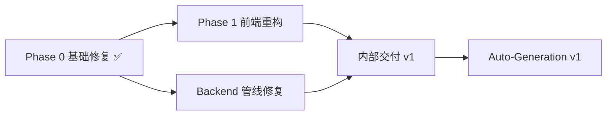

# ViMax Platform — Spec 索引

> **原则**：先 Spec → 评审 → Plan → 执行。未经 Spec 评审确认，不进入实现。

## 文档结构

| 文档 | 状态 | 说明 |
|------|------|------|
| [INTERNAL-V1.md](./INTERNAL-V1.md) | ✅ 已确认 | 内部交付 v1 总规格（产品 + 技术边界） |
| [PHASE0.md](./PHASE0.md) | ✅ 已实现 | Phase 0 基础修复规格与验收记录 |
| [PHASE1-FRONTEND.md](./PHASE1-FRONTEND.md) | ✅ 已确认 | Phase 1 前端架构重构规格 |
| [BACKEND-PIPELINE.md](./BACKEND-PIPELINE.md) | ✅ 已确认 | 后端管线修复规格 |
| [AUTO-GENERATION-V1.md](./AUTO-GENERATION-V1.md) | ✅ 已确认 | 创意输入自动生成分镜/镜头/成片规格 |
| [PROMPT-WORDS-RESEARCH.md](./PROMPT-WORDS-RESEARCH.md) | 🔍 待评审 | 提示词「联想词 + 限制词」板块调研与接入规格 |

## 里程碑关系



## 评审检查清单

评审人需对每份 Spec 确认：

- [ ] 范围边界清晰（含「不做」列表）
- [ ] 用户故事可验证
- [ ] 功能需求有唯一 ID（FR-xxx）
- [ ] 验收标准可测试
- [ ] 依赖与风险已识别
- [ ] 与现有代码库无重大冲突

## Plan 生成规则

Spec 评审通过后，由每份 Spec 末尾的「Plan 输入」章节生成对应 `PLAN.md`：

```
docs/plans/
├── PHASE1-PLAN.md      ← 从 PHASE1-FRONTEND.md 派生
└── BACKEND-PLAN.md     ← 从 BACKEND-PIPELINE.md 派生
```

## 评审决议（2026-07-16）

| 决策点 | 决议 |
|--------|------|
| i18n | **延后**（不在 Phase 1 范围） |
| JobReporter 修复 | **方案 A**（修正 handler 调用，不加别名） |
| 执行顺序 | **并行**（Phase 1 + Backend 同步推进） |

**当前阶段：Plan 已生成，并行执行中（Backend B1-B7 ✅，Phase 1 F1/F3/F4 进行中）。**
