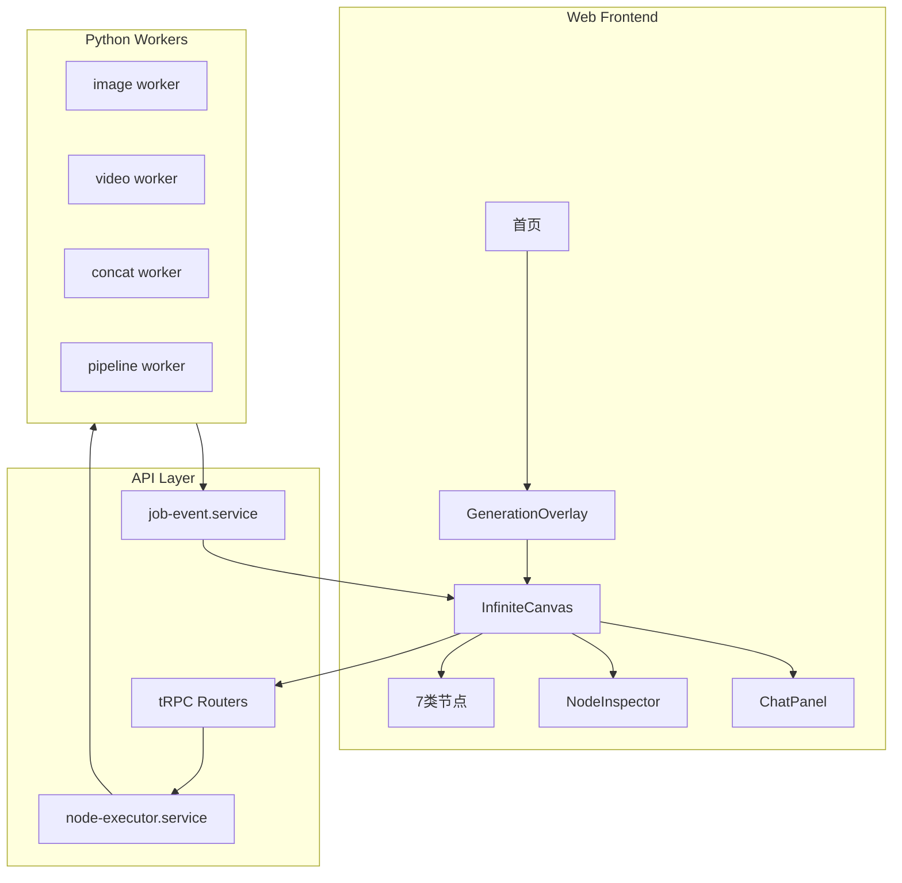

# Spec: ViMax 内部交付 v1

| 属性 | 值 |
|------|-----|
| 版本 | 1.0-draft |
| 状态 | 待评审 |
| 目标用户 | 内部团队成员（产品、运营、开发） |
| 对标参考 | LibTV 节点式画布（约 55% 功能对标） |

---

## 1. 背景

ViMax 具备两套视频生成能力：

- **Python CLI**：完整 Idea2Video / Script2Video 管线（成熟）
- **Platform 画布**：React Flow 节点式 UI + 单镜头 video/concat（部分可用）

Phase 0 已修复前端关键 bug（全屏画布、模型透传、预览、错误处理）。  
内部交付 v1 目标是让团队**无需开发陪同**即可完成短视频生产。

---

## 2. 目标与成功指标

### 2.1 目标

> 团队成员能在 30 分钟内，从创意输入到下载合成视频，全程在 Web 画布完成。

### 2.2 成功指标（KPI）

| 指标 | 目标 |
|------|------|
| 核心流程完成率 | ≥ 80%（有后端环境） |
| 首次使用无需指导 | ≥ 70% 用户可自助完成 |
| 生成失败可定位 | 100% 有明确错误提示 |
| P0 级 bug | 0 个 |

---

## 3. 用户角色

| 角色 | 诉求 |
|------|------|
| **创作者** | 输入灵感/剧本，调整分镜，生成并下载视频 |
| **开发者** | 代码可维护，模块边界清晰，可写测试 |
| **运维** | Worker 稳定，docker-compose 一键启动 |

---

## 4. 用户故事

### US-01 创建项目
> 作为创作者，我从首页选择模型并输入创意，系统创建画布并进入生成流程。

**验收**：模型参数写入 URL；进入画布后新建节点使用所选模型。

### US-02 剧本生成分镜
> 作为创作者，我在 script 节点粘贴剧本后，一键生成分镜格节点。

**验收**：点击「剧本转分镜」后，画布出现 ≥1 个 `storyboard_cell` 节点，连线到 script。

### US-03 逐镜头生成
> 作为创作者，我按流水线运行 shot → image → video 节点，在节点内预览结果。

**验收**：每步有 running/done/failed 状态；video 节点完成后可播放。

### US-04 合成下载
> 作为创作者，我将多个 video 节点连到 concat 节点，合成并下载 MP4。

**验收**：concat 完成后可预览；Inspector 下载区可用；文件可播放。

### US-05 错误恢复
> 作为创作者，当 API 或 Worker 失败时，我看到明确错误并可重试。

**验收**：无静默 fallback；失败节点显示 failed 状态；可单节点重试。

### US-06 全屏创作
> 作为创作者，我在画布工作台获得最大可视区域，无多余导航干扰。

**验收**：画布页无全局 TopNav；单层 44px header。

---

## 5. 范围

### 5.1 包含（内部 v1）

| 模块 | 内容 |
|------|------|
| Phase 0 | 基础修复（✅ 已完成） |
| Phase 1 | InfiniteCanvas 拆分、样式统一（精简版） |
| Backend | asset 类型修复、script2storyboard 落节点、JobReporter 修复 |
| 文档 | 内部操作手册（启动环境 + 标准流程） |

### 5.2 不包含

- 节点分组 / 工作流保存复用
- `pipeline.idea2video` / `pipeline.script2video` 全流程
- 音频节点 + `audio.generate` worker
- VideoWorkbench 真实剪辑 / 导出
- Explore 广场、素材库完善
- Agent Skill 对外开放
- 完整 i18n

---

## 6. 系统架构（内部 v1）



---

## 7. 核心数据流

### 7.1 标准生产路径（内部 v1）

```
script → [剧本转分镜] → storyboard_cell → shot → image → video → concat → 下载
```

### 7.2 节点类型

| 类型 | 可运行 | 产出 |
|------|--------|------|
| script | ❌ | 文本 |
| character | ✅ | 角色图 |
| storyboard_cell | ❌ | 分镜描述 |
| shot | ✅ | 首帧图 |
| image | ✅ | 图片 |
| video | ✅ | 视频 |
| concat | ✅ | 合成视频 |

---

## 8. 功能需求（跨模块）

| ID | 需求 | 模块 | 优先级 |
|----|------|------|--------|
| FR-IV1-01 | 画布全屏，无双层顶栏 | Phase 0 ✅ | P0 |
| FR-IV1-02 | 模型参数首页→画布透传 | Phase 0 ✅ | P0 |
| FR-IV1-03 | video 节点默认视频模型 | Phase 0 ✅ | P0 |
| FR-IV1-04 | 节点内视频预览 | Phase 0 ✅ | P0 |
| FR-IV1-05 | API 失败显式错误 | Phase 0 ✅ | P0 |
| FR-IV1-06 | InfiniteCanvas 拆分为 ≤300 行/文件 | Phase 1 | P1 |
| FR-IV1-07 | 画布区统一 Tailwind + tokens | Phase 1 | P1 |
| FR-IV1-08 | script2storyboard 自动创建分镜节点 | Backend | P0 |
| FR-IV1-09 | 视频 asset 标记 kind=video | Backend | P0 |
| FR-IV1-10 | JobReporter API 修复 | Backend | P0 |
| FR-IV1-11 | 内部操作文档 | Docs | P1 |

---

## 9. 非功能需求

| ID | 需求 | 标准 |
|----|------|------|
| NFR-01 | 首屏加载 | 画布 < 3s（本地） |
| NFR-02 | 自动保存 | 变更 800ms 防抖持久化 |
| NFR-03 | 测试覆盖 | 纯函数 100%；关键路径 ≥1 集成测试 |
| NFR-04 | 类型安全 | `pnpm typecheck` 零错误 |

---

## 10. 验收场景（E2E）

### E2E-01 灵感模式

```
1. 登录 → 首页选「灵感生视频」
2. 选 text/image/video 模型，输入创意
3. 开始生成 → 进入画布（URL 含 model 参数）
4. 运行 image → video 节点
5. 节点内预览视频
6. concat 合成 → 下载 MP4
```

### E2E-02 剧本模式

```
1. 首页选「剧本生视频」，粘贴剧本
2. 进入画布，选中 script 节点
3. 点击「剧本转分镜」
4. 确认生成 storyboard_cell 节点
5. 继续 shot → image → video → concat
```

### E2E-03 异常场景

```
1. 停止 API → 打开画布 → 显示错误 + 重试
2. 停止 video worker → 运行 video 节点 → 显示 failed
3. 右键删除节点 → 刷新 → 节点不出现
```

---

## 11. 依赖

| 依赖 | 说明 |
|------|------|
| docker-compose | image/video/concat/pipeline workers |
| Redis + Postgres + MinIO | 基础设施 |
| 模型 API Key | `.env` 配置 |
| Python ViMax agents | pipeline worker 挂载 VIMAX_ROOT |

---

## 12. 风险

| 风险 | 影响 | 缓解 |
|------|------|------|
| script2storyboard Agent 调用失败 | 分镜 job 标记 failed，前端显示错误 |
| 大文件视频预览慢 | 体验差 | preload=metadata，Inspector 下载兜底 |
| InfiniteCanvas 拆分引入回归 | 功能回退 | TDD + 保留 hooks 不变 |

---

## 13. 交付物清单

- [x] Phase 0 代码 + 测试
- [ ] Phase 1 代码 + 测试
- [ ] Backend 修复
- [ ] `docs/guides/INTERNAL-USAGE.md` 操作手册
- [ ] E2E 验收记录

---

## 14. 评审后的 Plan 输入

评审通过后，生成：

1. `docs/plans/PHASE1-PLAN.md`
2. `docs/plans/BACKEND-PLAN.md`
3. `docs/plans/INTERNAL-V1-ROLLOUT.md`（联调 + 验收排期）

**预估总工时（评审后确认）**：Phase 1（3-4d）+ Backend（2-3d）+ 联调（1-2d）= 约 1.5 周
