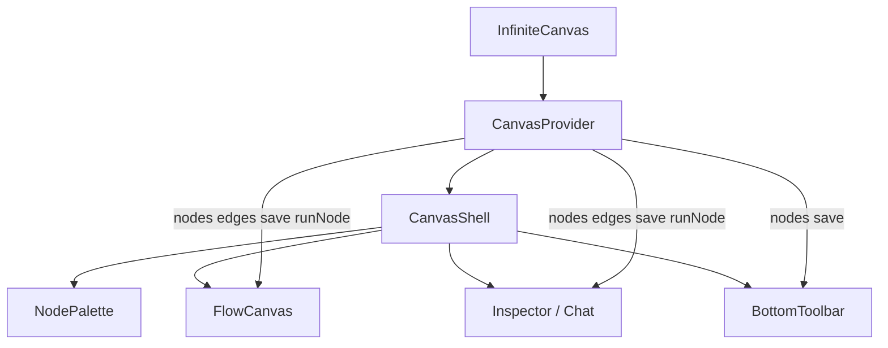

# Spec: Phase 1 — 前端架构重构（精简版）

| 属性 | 值 |
|------|-----|
| 版本 | 1.0-draft |
| 状态 | ✅ 已确认 |
| 前置依赖 | Phase 0 ✅ |
| 目标 | 代码可维护 + 视觉统一，为后续 LibTV 式功能留扩展点 |

---

## 1. 问题陈述

`InfiniteCanvas.tsx` 当前约 **1730 行**，混合布局、状态、事件、UI 渲染，导致：

- 新增功能成本高、回归风险大
- 画布区大量 inline style，与其他页面 Tailwind 体系割裂
- emoji 图标与 Lucide 图标混用
- 部分操作（复制节点）未持久化

---

## 2. 目标

| 目标 | 度量 |
|------|------|
| 单文件 ≤ 300 行 | InfiniteCanvas 拆为 8+ 模块 |
| 样式统一 | 画布 shell/toolbar 零 inline style |
| 可测试 | 新增 ≥3 个纯函数测试文件 |
| 零功能回退 | Phase 0 验收项全部通过 |

---

## 3. 范围

### 3.1 包含

| 类别 | 内容 |
|------|------|
| 结构拆分 | CanvasShell、FlowCanvas、NodePalette、BottomToolbar |
| 状态上下文 | CanvasProvider（nodes/edges/save/run） |
| 样式迁移 | shell + toolbar + palette → Tailwind + tokens |
| 图标统一 | palette/toolbar emoji → Lucide |
| Bug 修复 | 复制节点 save、拖拽 end save 闭包 |
| ~~i18n 基础~~ | **延后**（评审决议 2026-07-16） |

### 3.2 不包含

- 节点分组 / 工作流保存（Phase 2）
- AssetPanel 素材侧栏
- 每个节点组件拆独立文件（保持 `CanvasNodes.tsx`）
- VideoWorkbench 改造
- 完整 i18n 覆盖

---

## 4. 目标架构

```
features/canvas/
├── InfiniteCanvas.tsx          # ≤150行，编排入口
├── CanvasProvider.tsx          # 状态上下文
├── CanvasShell.tsx             # 全屏布局壳
├── layers/
│   └── FlowCanvas.tsx          # 纯 ReactFlow + 事件
├── sidebars/
│   └── NodePalette.tsx         # 从左侧面板抽出
├── toolbar/
│   └── BottomToolbar.tsx       # 从底部工具栏抽出
├── panels/                     # 已有，不拆
├── nodes/                      # 已有 CanvasNodes.tsx
├── hooks/                      # 已有，接口不变
├── utils/                      # Phase 0 已有
└── components/                 # Phase 0 已有
```

### 4.1 组件职责

| 组件 | 职责 | 行数目标 |
|------|------|---------|
| `InfiniteCanvas` | 组合 Provider + Shell，传递 props | ≤150 |
| `CanvasProvider` | nodes/edges/save/run/ws 上下文 | ≤200 |
| `CanvasShell` | 三栏布局 + tab 切换 | ≤120 |
| `FlowCanvas` | ReactFlow 渲染 + 快捷键 + drop | ≤250 |
| `NodePalette` | 节点拖拽面板 | ≤150 |
| `BottomToolbar` | 底部操作栏 | ≤200 |

### 4.2 数据流



---

## 5. 功能需求

| ID | 需求 | 优先级 |
|----|------|--------|
| FR-P1-01 | 抽出 `CanvasProvider`，子组件通过 context 访问状态 | P0 |
| FR-P1-02 | 抽出 `CanvasShell` 三栏布局 | P0 |
| FR-P1-03 | 抽出 `FlowCanvas`，含 ReactFlow 全部配置 | P0 |
| FR-P1-04 | 抽出 `NodePalette` 和 `BottomToolbar` | P0 |
| FR-P1-05 | `InfiniteCanvas.tsx` ≤ 150 行 | P0 |
| FR-P1-06 | shell/toolbar/palette 使用 Tailwind + tokens | P1 |
| FR-P1-07 | palette/toolbar emoji 替换为 Lucide | P1 |
| FR-P1-08 | 右键复制节点后调用 save | P1 |
| FR-P1-09 | `handleNodesChange` 拖拽结束用最新 state save | P1 |
| FR-P1-10 | AI Chat `nodes.add` 新节点应用 modelDefaults | P1 |
| FR-P1-11 | 纯函数 `filterNodesAfterDelete` 可测试 | P2 |

---

## 6. CanvasProvider 接口

```ts
interface CanvasContextValue {
  canvasId: string;
  nodes: Node[];
  edges: Edge[];
  setNodes: Dispatch<SetStateAction<Node[]>>;
  setEdges: Dispatch<SetStateAction<Edge[]>>;
  save: (nodes: Node[], edges: Edge[]) => void;
  runNode: (nodeId: string) => Promise<void>;
  isRunning: boolean;
  runningNodeId: string | null;
  progress: number;
  modelDefaults: ModelDefaults;
  selectedNode: Node | null;
  setSelectedNode: (node: Node | null) => void;
}
```

**约束**：现有 hooks（`useCanvasSnapshot`、`useNodeRun`、`useUndoRedo`）接口不变，Provider 内部组合它们。

---

## 7. 样式规范

### 7.1 Token 使用

| 用途 | Token |
|------|-------|
| 背景 | `--color-canvas`, `--color-surface-1` |
| 边框 | `--color-hairline` |
| 文字 | `--color-ink`, `--color-ink-muted` |
| 强调 | `--color-accent` |

### 7.2 禁止

- 新代码中使用 inline `style={{}}`（节点组件除外，Phase 2 再改）
- 新代码中使用 emoji 作为功能图标

---

## 8. TDD 计划

| 测试文件 | 覆盖函数 |
|---------|---------|
| `graph-mutations.test.ts` | `removeNodeFromGraph`, `copyNode` |
| `canvas-navigation.test.ts` | 已有，保持 |
| `node-defaults.test.ts` | 已有，保持 |

### 8.1 示例：`removeNodeFromGraph`

```ts
removeNodeFromGraph(nodes, edges, nodeId)
// → { nodes: filtered, edges: filtered }
// 断言：无残留边、节点数 -1
```

---

## 9. 迁移策略

```
Step A  创建 CanvasProvider + 空壳组件（不改行为）
Step B  逐块搬迁：BottomToolbar → NodePalette → FlowCanvas → CanvasShell
Step C  InfiniteCanvas 瘦身为编排入口
Step D  样式迁移 + 图标替换
Step E  Bug 修复 + 测试
```

**原则**：每步完成后 `pnpm test && pnpm typecheck` 全绿，可独立合并。

---

## 10. 验收标准

| # | 验收项 |
|---|--------|
| 1 | `InfiniteCanvas.tsx` ≤ 150 行 |
| 2 | 无单文件 > 300 行（NodeInspector 除外） |
| 3 | Phase 0 全部 E2E 场景仍通过 |
| 4 | 复制节点后刷新，副本仍存在 |
| 5 | 拖拽节点后刷新，位置已保存 |
| 6 | palette/toolbar 无 emoji 图标 |
| 7 | `pnpm test` 全绿 |

---

## 11. 风险

| 风险 | 缓解 |
|------|------|
| Context 导致不必要重渲染 | 拆分 memo + selector |
| 搬迁过程功能回退 | 小步提交 + 保留原函数签名 |
| NodeInspector 1700 行未拆 | 本 Phase 不拆，降低范围 |

---

## 12. Plan 输入（评审后生成）

评审通过后生成 `docs/plans/PHASE1-PLAN.md`，包含：

- 5 步迁移任务分解
- 每日 checkpoint
- 文件级 diff 预估
- 预估工时：**3-4 人天**

**当前不执行，等待 Spec 评审确认。**
